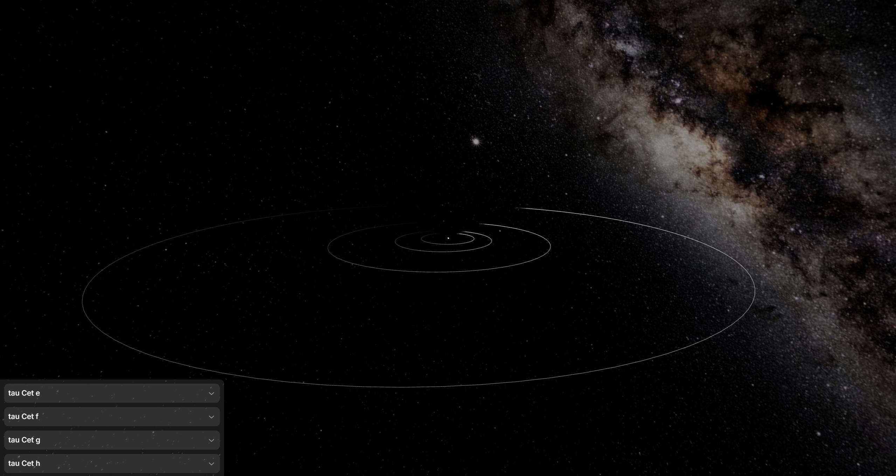

<h2>
  ExoLace
</h2>

<h4>
  Visualize thousands of exoplanetary systems in a single webpage
</h4>

<h3>
  Usage
</h3>

Select a host from the list and explore its orbiting exoplanets

<h3>
  Motivation
</h3>

Project created to explore and experiment with 3D libraries like [@react-three/fiber](https://github.com/pmndrs/react-three-fiber) and [@react-three/drei](https://github.com/pmndrs/drei).

<h3>
  Sources
</h3>

[NASA Exoplanet Archive](https://exoplanetarchive.ipac.caltech.edu/index.html)
